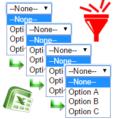

# Work Item Custom Control for Cascading Select Field(s)

## Usage

1. Fork or clone the repository
1. Open a shell and change to the directory where you cloned the project
1. Perform the following actions
    1. Run `npm install` to install required dependencies
    1. Run `npm install -g grunt` to install grunt globally
    1. Run `npm install -g tfx-cli` to install the TFS CLI
    1. Update the `category` value in the 'vss-extension.json' file (line: ~95) to one of the following:
        - `Plan and track` to target TFS 2017
        - `Azure Boards` to target TFS 2019
    1. Run `grunt package-dev`
    1. Open a browser and navigate to your ADO organization
    1. Open the Marketplace
    1. Click "Browse local extensions".
    1. Scroll down and click on the "Manage Extensions".
    1. Click "Upload new extension".
    1. Drag and Drop the generated file from your packaged project (vsix).
    1. Click "Upload".
    1. Hover over the extension when it appears in the list, and click "Install".

This should should install the extension in your collection.  
Next step will add the control to the work item form.

## Create CSV File

Create a CSV file to use as the data source for the cascading fields control. The control is quite performant so it can handle a large volume of values.
The columns of the CSV represent each of the 1-4 cascaded fields. In the illustration, the column labeled **1** represents the values that will be displayed in your first level field. Values in the column labled **2** represent the values that will be displayed in the second level field, filtered to only those values that align with the value selected in the level 1 field. The same applies for columns 3 and 4.
A few key points:

- The first column should be named `Field`. You can name the other column
- Ensure there are no trailing spaces
- The underlying code uses the CSV file name as the unique data source identifier for the control. This allows you to easily upload multiple data sources (CSV) for use with multiple instances of the custom control. When configuring the custom control on the Work Item form, you will use CSV file name, without the `.csv` extension, to tell the control which data source to use. As an example, if you named your CSV file `foo.csv`, you will put the value `foo` into the 'Control Name` field value, on the custom control's Options tab.

_CSV file format example/illustration_

## Upload the CSV file

Use the action menu added in the work item Form.  
"Upload Dependencies"

## Define the extension in Azure DevOps

There are nine inputs parameters, four of them are optional.  
*Control Name* : The name of the control (you can put more than one). This name will be used to save the list values in the storage, so it is important to provide meaningful name(s).  
*FieldName* (1-4) : The field name that the user sees.  
*Field* (1-4) : The optional values that the user can select.  
*FieldName* and *Field* (3-4) are optional (if you want to cascade more the 2 lists).

## Use your Controller

## If you still working with xml

Set your fields

Set the extenshion

Add the control to the view

